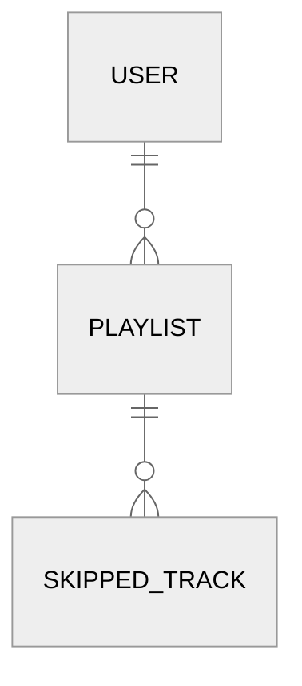
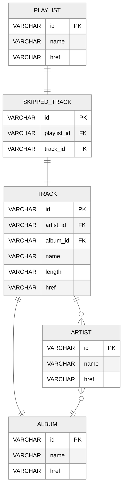

# spotify-playlist-janitor

## What is the application?
This is an application that monitors a user's Spotify activity, identifying songs that the user repeatedly skips past when listening to playlists, and give the user the opportunity to easily remove these songs, thus improving their listening experience.

## Why?
Spotify is great at suggesting new songs and artists to try based on your listening habits, but it does not offer users any insight into the songs they do not enjoy listening to. Often our tastes change over time, and songs we add to a ***Songs I ♥*** playlist today might not be what we want to listen to regularly in 6 months time. This coupled with the fact that people often listen to music while driving, exercising, or generally not at a computer means that we will often just hit the ⏩ button and leave these song where they are, resulting in playlists bloated with songs we don't want to hear anymore.

This application aims to reduce the effort of identifying and removing this playlist bloat to few clicks worth of effort.

## How?
The user will authenticate the application's API with their Spotify account so that it can read/modify playlists and read their current playback state. It will then poll their current playback state every 0.5 seconds so that it can track when a song begins playing and then a different song begins within a short space of time, establishing that a `skip` has occurred. If this `skip` happened while listening to a playlist chosen by the user, it will be recorded in a database. These `skips` can then be presented to the user via a single-page application so the user can see what songs they are skipping in their chosen playlists, and allow the user to remove these songs if they wish.

### MVP
* Authorize application with users Spotify account
* Read users current playback activity
* Read and display users playlists
* Select playlists to monitor
* Display skipped tracks for each playlist
* Select tracks to remove from each playlist

### Stretch Goals
* Custom rules for each playlist:
    * Choose between time elasped or percentage played to decided if a song has been skipped
    * Automatic playlist cleanup once a specified number of skips has occured
* Create copy of playlists without skipped tracks
* Live display of users current playback activity
* Application resilience: no need to reauthorize with Spotify if application restarted unexpectedly 

## Domain Model

## Entity-Relationship Diagram
