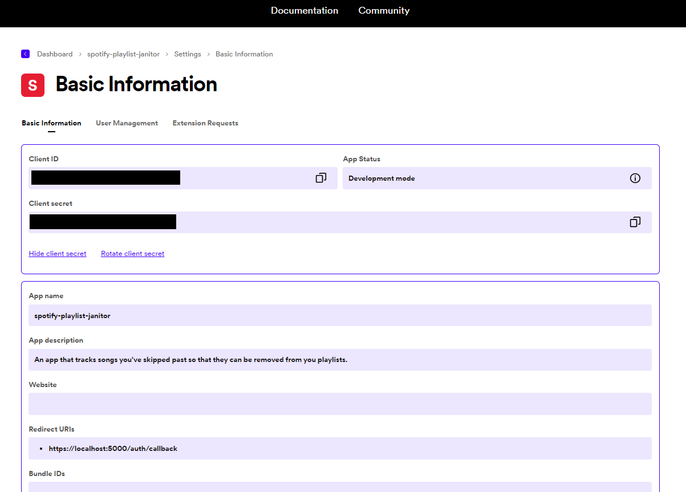

# Spotify Configration

For the `spotify-playlist-janitor` for function you will need to create an app in your Spotify Developer Dashboard, steps found [here](https://developer.spotify.com/documentation/web-api/tutorials/getting-started). Add any value for `Redirect URI` to begin with.

Once created, go to the settings page for you app and you'll see this page:

The `Client ID` and `Client secret` values must be copied into these lines of `docker-compose.yml`, replacing `${SPOTIFY_CLIENT_ID}` and `${SPOTIFY_CLIENT_SECRET}` respectively. 

The `Redirect URI` must be updated after the `spotify-playlist-janitor` has been deployed to ensure that the correct url/port has been configured to actual values of the deployed application (depending on the local ports, or url if deploying to the cloud).

